# TrackBallBar キーボード(右)拡張ユニット
キーボード(右)拡張ユニットは、TrackBallBarに、
テンキーレスキーボードの右半分を追加するユニットです。

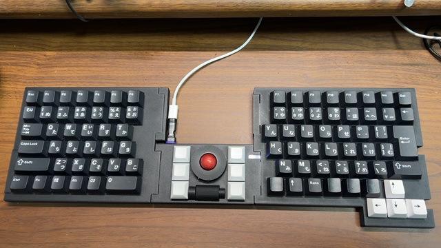
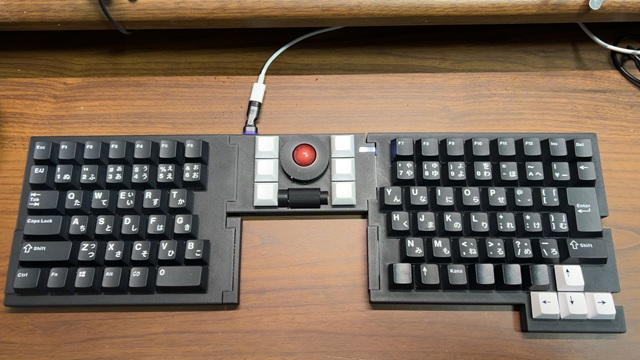

## 特徴
- テンキーレスキーボードの右半分です。
- MX互換キースイッチが使用できます。
- 接続コネクタが左に２，右に１あります。左を同時に２つ使うこともできます。
- はんだづけが必要なキットとなります。

## パッケージ内容
- キーボード(右)拡張ユニットケース
- コネクタキャップ(左)×2
- コネクタキャップ(右)×1
- コネクタ取り付け用治具×4
- キーボード(右)拡張ユニット基板
- 2x10(20)ピンソケット×2
- 2x10(20)ピンヘッダ×1
- M3ラミメイトネジ×7
- ガスケット(外径7mm、内径3mm、厚2mm)×7

## 別途必要な物
- MX互換キースイッチ×48
- キーキャップ×48
- スタビライザー(2U)×1 (推奨)
- はんだこて
- はんだ

## はんだづけ作業
- 60ピン(20ピンソケットx2、20ピンヘッダx1)

## サイズ
- 幅: 185mm
- 奥行: 150mm
- 高さ: 14mm(キー含まず)

## 使用上の注意
- ケースは3Dプリンターによる自家製です。細かい傷などありましても、ご容赦ください。
- ケースはPLAで作成しています。50度ほどで変形しますので、温度には注意してください。

## 組み立て手順
1. ピンソケットにピンヘッダを差し込みます。 
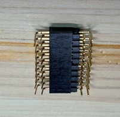
2. 基板の表側の右下に1のピンヘッダを差し込みます。
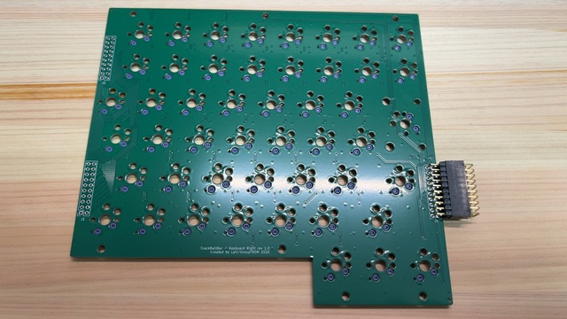
3. コネクタ取り付け用治具を基板のコネクタのあたりにはめます。 
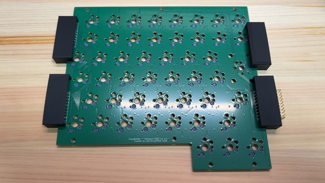
4. 基板を裏返しにします。 
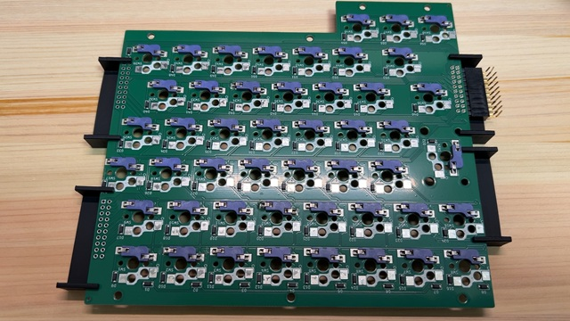
5. ピンソケットが治具に水平に載るように調整してから、はんだづけします。
6. ピンソケットを外します。
7. 基板の表側の左下にピンソケットを差し込みます。
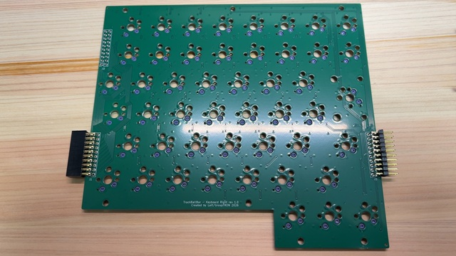
8. コネクタ取り付け用治具を基板のコネクタのあたりにはめます。 
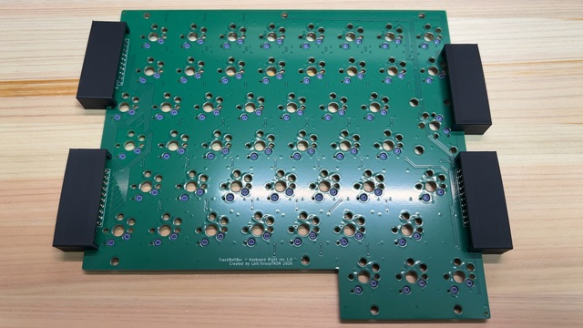
9. 基板を裏返しにします。 
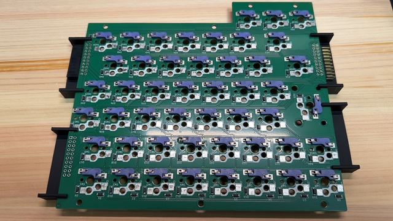
10. ピンソケットが治具に水平に載るように調整してから、はんだづけします。
11. 基板の表側の左上にピンソケットを差し込みます。 
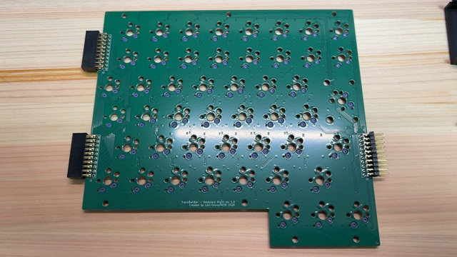
12. コネクタ取り付け用治具を基板のコネクタのあたりにはめます。 
13. 基板を裏返しにします。 
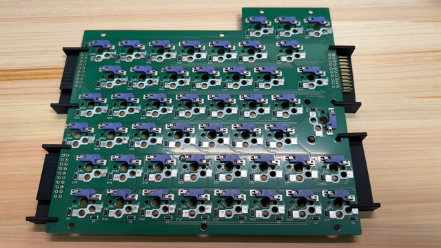
14. ピンソケットが治具に水平に載るように調整してから、はんだづけします。
15. 2Uスタビライザーを1か所、取り付けます。 
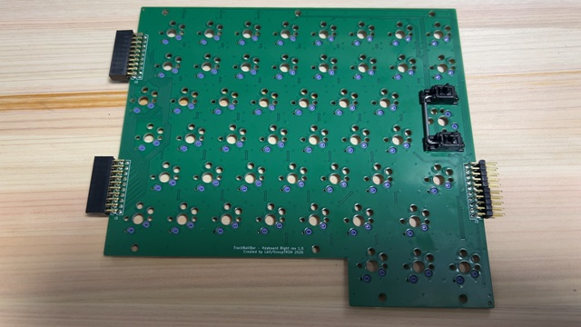
16. ケースの底板のネジ穴7か所に、(気休めの)ブラケットを載せます。 
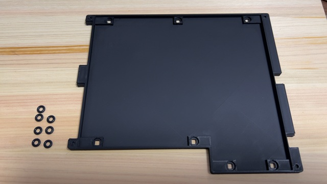
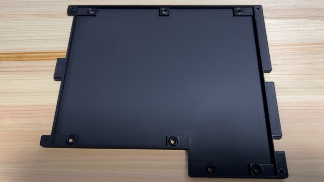
17. ケースの底板に基板を載せます。 
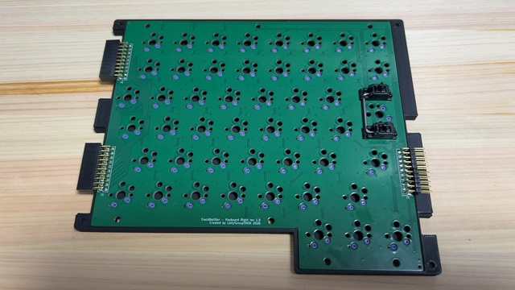
18. ケースの上板をかぶせます。 
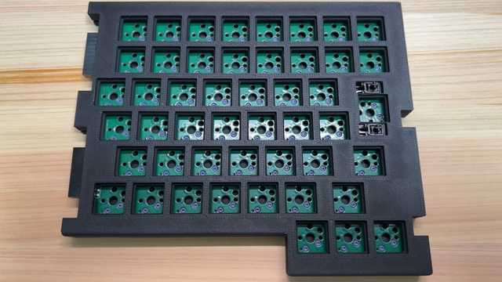
19. ケースを裏返しにし、ねじどめします。 
注意：ナットを使わず、3Dプリントしたケースに直接ねじどめするため、あまり強く締めないでください。 
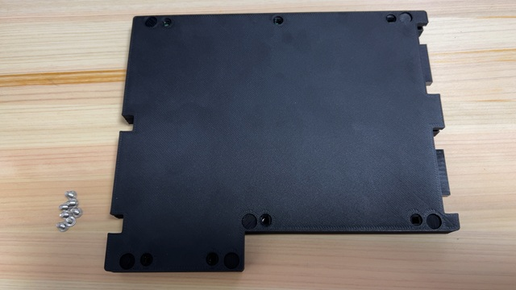
20. 裏返し、キースイッチを付けます。 
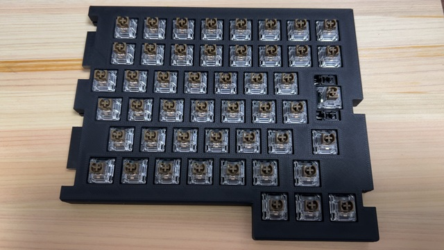
21. キーキャップを付けます。 
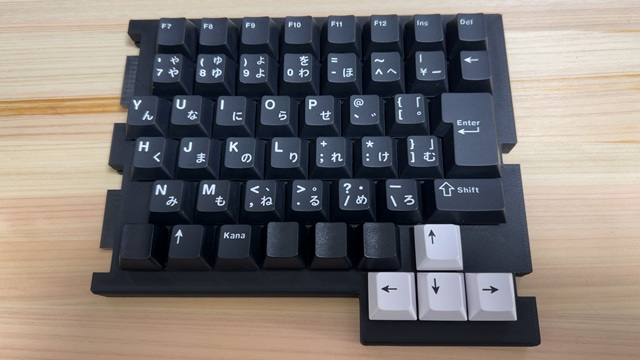

## キーマップ
vialでのキー位置は以下になります。
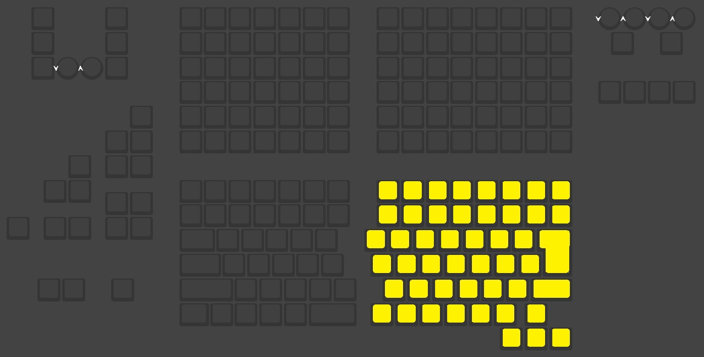

## 回路図
[回路図(PDF)](imgs/keyboardright_rev1.0.pdf)